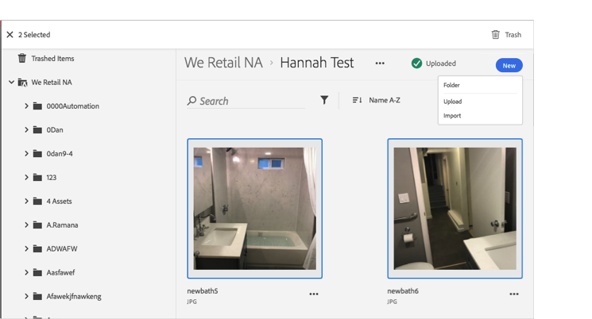

# Papperskorgen{#trash-an-asset}

Du kan kasta en resurs i Adobe Experience Cloud-biblioteket om du vill ta bort den från biblioteket.

Så här sopar du undan en resurs i Experience Cloud-biblioteket:

1. Klicka på en eller flera resurser som ska papperskorgen. 

1. Klicka på **[!UICONTROL Trash]** ikonen längst upp på sidan.

