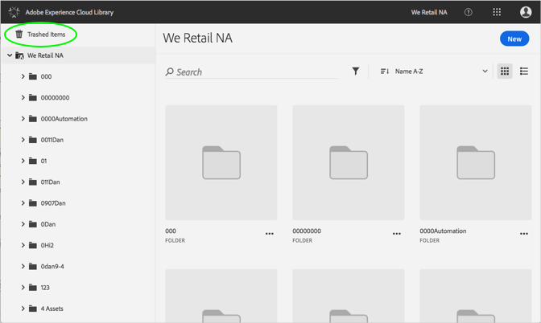
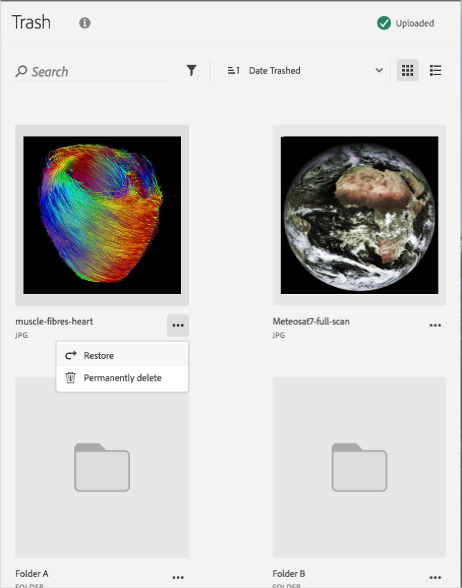

# Ta bort en trasig resurs permanent{#permanently-delete-a-trashed-asset}

Du kan ta bort en trasig resurs permanent i Adobe Experience Cloud-biblioteket.

När du papperskorgar ett objekt finns det i området för streckade objekt i Experience Cloud-biblioteket i 60 dagar. Om du inte återställer objekt tas de bort permanent efter 60 dagar.

Du kan ta bort en trasig resurs permanent tidigare än 60 dagar genom att:

1. Klicka på **[!UICONTROL Trashed Items]**.

   

1. Klicka på ett eller flera objekt om du vill ta bort dem permanent.
1. Klicka på **[!UICONTROL More Info > Permanently delete]**.

   

1. Bekräfta att du vill ta bort de markerade resurserna permanent.

