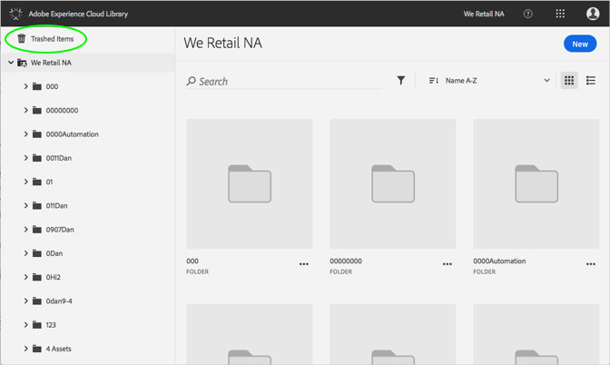

# Återställa en trasig resurs{#restore-a-trashed-asset}

Du kan återställa en resurs som du har sparat i Adobe Experience Cloud-biblioteket.

När du papperskorgar ett objekt finns det i området för streckade objekt i Experience Cloud-biblioteket i 60 dagar. Om du inte återställer objekt tas de bort permanent i Experience Cloud efter 60 dagar.

Återställ en trasig resurs tidigare än 60 dagar med:

1. Klicka på **[!UICONTROL Trashed Items]**.

   

1. Klicka på ett eller flera objekt som ska återställas.
1. Klicka på **[!UICONTROL More Info > Restore]**.

   

1. Bekräfta att du vill återställa de markerade resurserna.

Bekräftelse av den återställda resursen visas högst upp.
