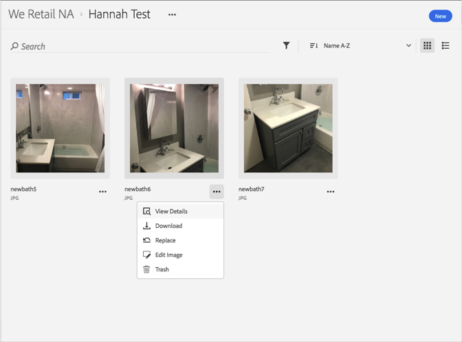

# Hämta en resurs{#download-an-asset}

Du kan hämta en resurs i Adobe Experience Cloud-biblioteket.

1. Klicka på en resurs.
1. Klicka på **[!UICONTROL More Options]** menyn (ellipsen) bredvid resursen.

   

1. Klicka **[!UICONTROL Download]** för att hämta resursen.

