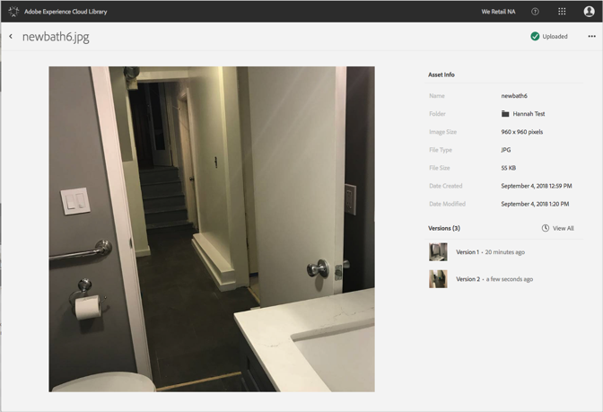

# Återgå till en äldre version av en resurs{#revert-to-an-older-version-of-an-asset}

Du kan återgå till en äldre version av en resurs i Adobe Experience Cloud-biblioteket.

Så här återgår du till en äldre version av en resurs i Experience Cloud-biblioteket:

1. Klicka på en resurs.
1. Klicka på **[!UICONTROL More Options]** menyn (ellipsen) bredvid resursen.

   

1. Klicka på **[!UICONTROL Asset Details]**.
1. Klicka på **[!UICONTROL View All]** bredvid Versioner för att se alla versioner av resursen.

   

1. I versionslistan klickar du på **[!UICONTROL More Options]** -menyn (ellipsen) bredvid den version du vill återställa.

   

1. Klicka på **[!UICONTROL Revert]**.

Den version som du återgick till blir nu den aktuella versionen.
