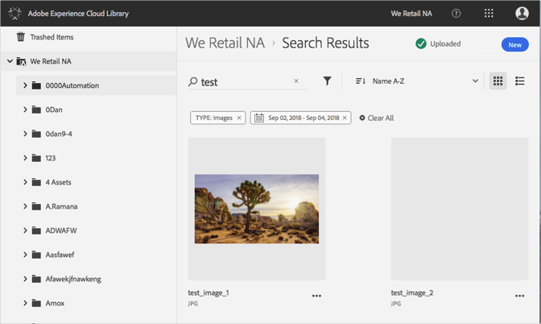

# Sök efter resurser{#search-for-assets}

Sök efter resurser i Adobe Experience Cloud Library om du vill söka efter resurser i hela organisationen eller i en viss mapp.

Sök efter resurser i Experience Cloud-biblioteket med hjälp av sökfältet. Sökningen söker igenom filnamn.

