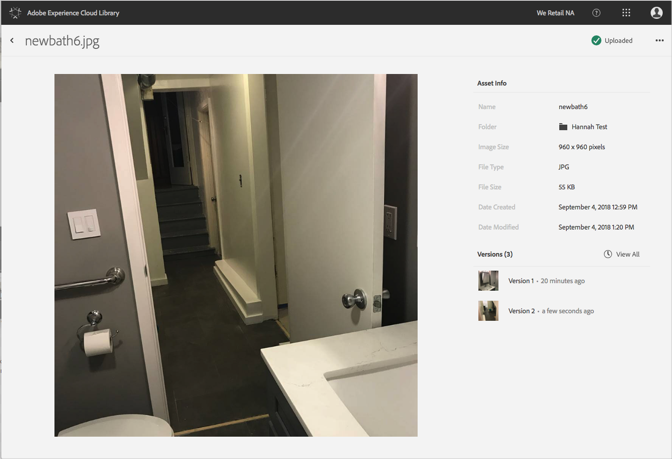

# Visa detaljerad information om en resurs{#view-detailed-information-for-an-asset}

Se detaljerad information om material, inklusive versioner, i Adobe Experience Cloud Library.

Så här visar du detaljerad information om resurser, inklusive versioner, i biblioteket Experience Cloud:

1. Klicka på en resurs.
1. Klicka på **[!UICONTROL More Options]** menyn (ellipsen) bredvid resursen.

   

1. Klicka **[!UICONTROL View Details]** för att visa mer information om en resurs.

   

