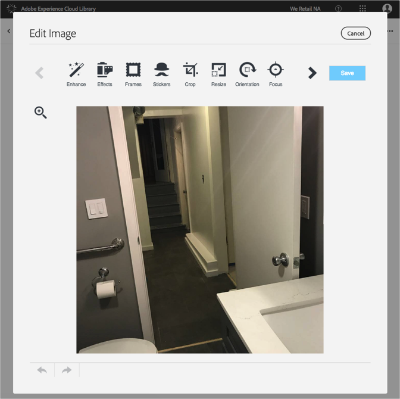

# Redigera en bild{#edit-an-image}

Använd den grundläggande bildredigeraren som är inbyggd i Adobe Experience Cloud Library för att redigera en bild direkt från biblioteket.

Så här redigerar du en bild från biblioteket Experience Cloud:

1. Klicka på en bild som du vill redigera.
1. Klicka på Redigera bild. När du sparar bilden sparas den som en ny version.

   Bildredigeraren öppnas och du kan redigera bilden.

   

