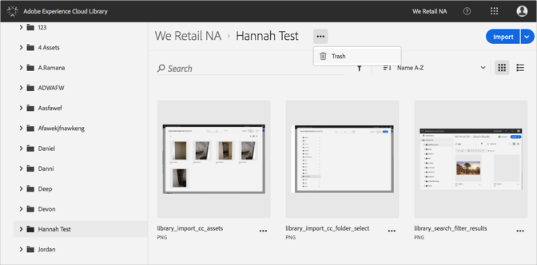
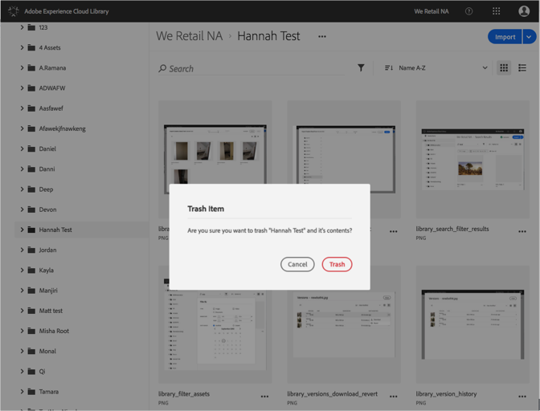

# Skräp en mapp{#trash-a-folder}

Du kan spara en mapp i Adobe Experience Cloud-biblioteket.

Så här sopar du en mapp i Experience Cloud-biblioteket:

1. Klicka på mappen som ska papperskorgen.
1. Klicka på **[!UICONTROL More Options Menu]** (ellips) och markera **[!UICONTROL Trash]**.

   

1. Bekräfta att du vill papperskorgen för mappen.

   

