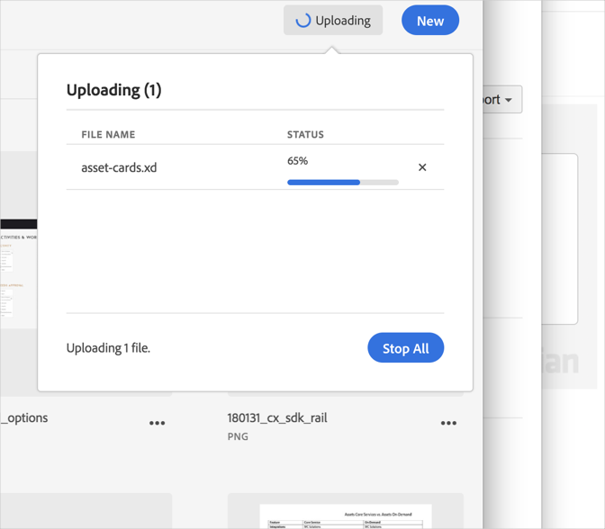

# Avbryt en överföring{#cancel-an-upload}

Avbryt en överföring från enheten till Adobe Experience Cloud-biblioteket om du har valt fel eller för stor fil.

Så här avbryter du en överföring som redan har startat:

1. Klicka på meddelandeindikatorn.
1. Klicka **[!UICONTROL Stop All]** om du vill stoppa alla nedladdningar eller klicka på **[!UICONTROL X]** bredvid enskilda filer som ska avbrytas.

   

Om du markerar en eller flera filer med samma namn uppmanas du att ersätta de gamla eller behålla de nya versionerna i Experience Cloud-biblioteket.
