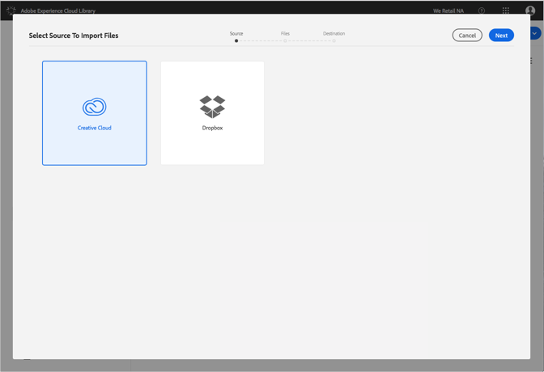

# Ändra Dropbox- eller Creative Cloud-konton{#change-dropbox-or-creative-cloud-accounts}

Växla till en annan Dropbox eller ett annat Creative Cloud-konto om du vill lägga till innehåll i Adobe Experience Cloud-biblioteket.

När du har loggat in på ett Dropbox- eller Creative Cloud-konto är du fortfarande inloggad, såvida du inte loggar ut eller byter konto.

Så här byter du till en annan Dropbox eller ett annat Creative Cloud-konto:

1. Välj **[!UICONTROL New]** > **[!UICONTROL Import]**.

   

1. Markera **[!UICONTROL Creative Cloud]** eller **[!UICONTROL Dropbox]**.

   

1. Välj **[!UICONTROL Next]**.
1. Välj kugghjulsikonen i det övre högra hörnet.

   

1. Välj **[!UICONTROL Sign out]**.
1. Logga in på det andra kontot.

