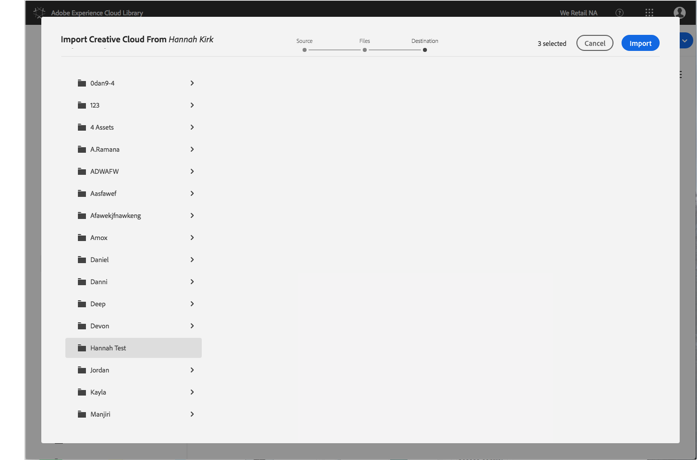

# Importera Creative Cloud-filer till Adobe Experience Cloud-biblioteket{#import-creative-cloud-files-into-the-adobe-experience-cloud-library}

Importera filer från Creative Cloud till Adobe Experience Cloud-biblioteket för att hantera dem från alla Adobe Experience Cloud-produkter.

>[!NOTE]
>
>Du måste skapa en mapp innan du kan utföra den här uppgiften.

Så här importerar du Creative Cloud-filer till Experience Cloud-biblioteket:

1. Välj **[!UICONTROL New]** > **[!UICONTROL Import]**.

   

1. Välj **[!UICONTROL Creative Cloud]**.

   Logga in på ditt Creative Cloud-konto om du inte redan gjort det.

   

1. Klicka på **[!UICONTROL Next]**.
1. Markera en eller flera filer som ska importeras.

   

1. Klicka på **[!UICONTROL Next]**.
1. Välj i vilken mapp resurserna ska placeras.

   >[!NOTE]
   >
   >Du kan välja en mapp där resurserna ska importeras. Om du vill placera filer i olika mappar upprepar du den här uppgiften för varje mapp.

   

1. Klicka på **[!UICONTROL Import]**.

