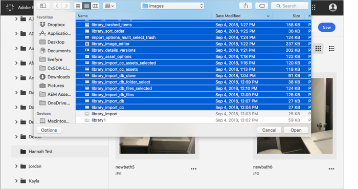
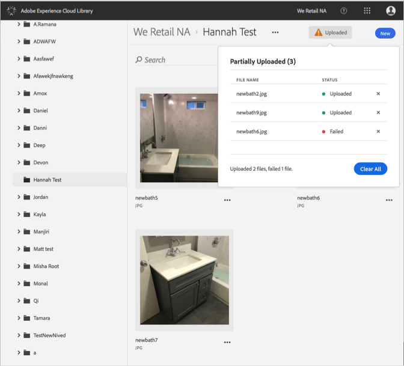

# Överför resurs från enhet{#upload-asset-from-device}

Överför resurser från din enhet för att hantera dem i Adobe Experience Cloud-biblioteket.

Så här överför du resurser från din enhet till Experience Cloud-biblioteket:

1. Välj **[!UICONTROL New]** > **[!UICONTROL Upload]**.

   

1. Välj de resurser som ska överföras till Experience Cloud-biblioteket.

   

1. När filerna har överförts visas en bekräftelse eller eventuella felmeddelanden i meddelanderutan.

   

